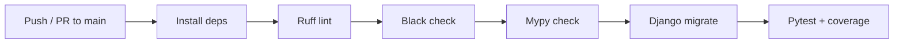

# Clinic Portal

Django-based clinic management portal, built with Python 3.11, tested with pytest, linted with Black/Ruff/Mypy, and shipped through GitHub Actions CI.

## Requirements

- Python 3.11 (get it [here](https://www.python.org/ftp/python/3.11.5/python-3.11.5-amd64.exe))
- Git
- Docker (optional, for container demos)
- VSCode with the Python and Django extensions recommended

## Installation

Clone the repo and enter it:

```powershell
git clone https://github.com/ligitpizza/clinic-portal.git
cd clinic-portal
```

Create and activate a virtual environment:

```powershell
python -m venv venv
venv\Scripts\Activate.ps1
```

Install runtime and dev dependencies:

```powershell
python -m pip install -r requirements.txt
python -m pip install -r requirements-dev.txt
```

Run migrations and create an admin user:

```powershell
python manage.py migrate
python manage.py createsuperuser
```

Start the dev server:

```powershell
python manage.py runserver
```

Admin panel: `http://127.0.0.1:8000/admin`

## Usage

### Running tests

```powershell
pytest --cov=accounts
```

Pytest config lives in `pyproject.toml` under `[tool.pytest.ini_options]`, which points to `clinic_portal.settings` so Django loads correctly during test collection.

### Code quality

Run all three before every commit:

```powershell
black .
ruff check . --fix
mypy .
```

| Tool | Purpose |
|---|---|
| **Black** | Auto-formats code style (quotes, spacing, line length) |
| **Ruff** | Lints for unused imports, bugs, and style issues; auto-fixes what it can |
| **Mypy** | Static type checking |

Config for all three lives in `pyproject.toml`.

### Docker (optional)

```powershell
docker compose up
```

Builds the image from `Dockerfile` and serves the app at `http://localhost:8000`, using a bind mount so local file changes reflect immediately.

## CI/CD

Every push or pull request to `main` triggers `.github/workflows/ci.yml`, which runs on Python 3.11 and 3.13:



If any step fails, the run is marked red in the **Actions** tab and the rest of the pipeline for that Python version stops.

## Project structure

```
clinic-portal/
├── accounts/
│   ├── test/              # pytest test package
│   ├── models.py
│   ├── views.py
│   └── admin.py
├── clinic_portal/
│   ├── settings.py
│   └── urls.py
├── .github/workflows/ci.yml
├── Dockerfile
├── docker-compose.yml
├── pyproject.toml          # Black, Ruff, Mypy, pytest config
├── requirements.txt         # runtime dependencies
├── requirements-dev.txt     # test + lint tooling
└── manage.py
```

## Notes

- `requirements.txt` holds only what the app needs to run in production. `requirements-dev.txt` holds testing and linting tools — keep them separate.
- `db.sqlite3` is gitignored. Run `python manage.py migrate` after cloning to generate it locally.
- `ALLOWED_HOSTS` and other settings carry explicit type annotations (e.g. `list[str]`) to satisfy Mypy.
